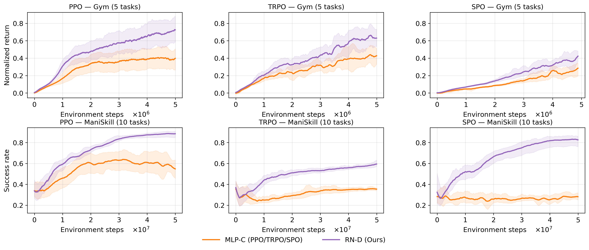

<h1 align="center">RND-RL</h1>

<h3 align="center"><i>RN-D: Discretized Categorical Actors for On-Policy Reinforcement Learning</i></h3>

<p align="center">
  <b>Yuexin Bian</b><sup>1</sup> &nbsp;·&nbsp;
  <b>Jie Feng</b><sup>1</sup> &nbsp;·&nbsp;
  <b>Tao Wang</b><sup>1</sup> &nbsp;·&nbsp;
  <b>Yijiang Li</b><sup>1</sup> &nbsp;·&nbsp;
  <b>Sicun Gao</b><sup>1</sup> &nbsp;·&nbsp;
  <b>Yuanyuan Shi</b><sup>1</sup> &nbsp;·&nbsp;
  <br>
  <sup>1</sup>University of California San Diego &nbsp;&nbsp; 
  <br><br>
  <b>ICML 2026</b>
</p>

<p align="center">
  <a href="https://arxiv.org/pdf/2601.23075"></a>
  <a href="https://github.com/alwaysbyx/RND-RL"></a>
  <a href="LICENSE"></a>
</p>

We demonstrate that our approach significantly im-
proves RL performance and accelerates convergence
across standard locomotion and ManiSkill bench-
marks, covering both state-based and vision-based
tasks. Moreover, the method is algorithm-agnostic and
consistently benefits multiple on-policy algorithms

<p align="center">
  
</p>

---

## TL;DR

Simply replacing the standard Gaussian actor with
our proposed actor substantially improves perfor-
mance for continuous control, achieving state-of-the-art results within
on-policy RL. 


## News

- **2026-05** — Paper accepted to **ICML 2026** 🎉
- **2026-05** — Code release.

## Installation

```bash
git clone https://github.com/alwaysbyx/RND-RL.git
cd RND-RL
conda env create -f environment.yml
conda activate rl
```

ManiSkill environments require additional setup; see the [ManiSkill installation guide](https://maniskill.readthedocs.io/en/latest/user_guide/getting_started/installation.html).

## Quick Start

Train PPO on a Gym MuJoCo task with a residual actor and discretized action head:

```bash
python train.py --config configs/gym.yaml --config_overrides "['env_id=HalfCheetah-v4']"
```

Train on a ManiSkill state-based task:

```bash
python train.py --config configs/maniskill-state.yaml --config_overrides "['env_id=PickCube-v1']"
```

Train on a ManiSkill RGB task:

```bash
python train.py --config configs/maniskill-rgb.yaml --config_overrides "['env_id=PickCube-v1']"
```

Train with TRPO:

```bash
python scripts/train_trpo/run_trpo_gym_dynamic.py
```

Train with PPO-CMA (baseline):

```bash
python train_ppocma.py --config configs/gym-ppocma.yaml
```

### Key flags

| Flag | Description |
| --- | --- |
| `discrete_action` | Discretize each action dimension into `num_bins` bins |
| `num_bins` | Number of bins per action dimension (default `41`) |
| `use_residual_blocks` | Use Simba-style residual actor instead of MLP |
| `actor_width` / `actor_depth` | Actor hidden width / number of residual blocks |
| `critic_width` / `critic_depth` | Critic hidden width / depth |

## Weights & Biases

We use [Weights & Biases](https://wandb.ai) for experiment tracking. **Before running, configure your own W&B project**:

1. Install and log in once:
   ```bash
   pip install wandb && wandb login
   ```
2. Set your entity and (optionally) project name. You can do this in three ways:

   **Per-run via CLI override**
   ```bash
   python train.py --config configs/gym.yaml --config_overrides "['track=true','wandb_entity=<your-entity>','wandb_project_name=<your-project>']"
   ```

   **In a config file** — edit the `wandb_entity` / `wandb_project_name` fields in `configs/*.yaml`.

   **In the launcher scripts** — each script in `scripts/` has a clearly marked
   ```python
   "wandb_entity": None,  # TODO: set to your wandb entity
   ```
   near the top. Set it before running paper sweeps. The dynamic schedulers (`run_*_dynamic.py`) additionally use the entity to skip already-finished runs; pass `--no-wandb-check` to bypass this.

To disable W&B entirely, run with `track=false` (the default) — TensorBoard logs are still written under `runs/`.

## Reproducing Paper Experiments

The launcher scripts in `scripts/` sweep seeds, environments, and method variants used in the paper. They auto-distribute jobs across available GPUs.

```bash
# Gym (MuJoCo) ablation: discrete × residual variants
python scripts/run_gym_experiments.py

# ManiSkill state-based benchmark
python scripts/run_maniskill_state_experiments.py

# ManiSkill RGB benchmark
python scripts/run_maniskill_rgb_experiments.py

# Architecture ablation (residual vs MLP, discrete vs continuous)
python scripts/run_ablation_dynamic.py

# Baselines
python scripts/run_ppocma_gym_experiments.py
python scripts/run_ppocma_maniskill_state_experiments.py
```

Logs are written to `runs/` and (optionally) Weights & Biases. Generate the paper figures with:

```bash
python scripts/make_demo_video.py     # qualitative rollouts
# plotting utilities: see figures/
```

## Repository Structure

```
RND-RL/
├── train.py                 # Unified PPO trainer (Gym + ManiSkill state/RGB)
├── train_ppocma.py          # PPO-CMA baseline trainer
├── rnd.py                   # Agent, residual actor, discrete-action head, NatureCNN
├── ppocma.py                # PPO-CMA agent
├── eval.py                  # Evaluation loop
├── configs/                 # Hydra/YAML configs (gym, maniskill-state, maniskill-rgb, ...)
├── envs/                    # Env wrappers (Gym, ManiSkill state, ManiSkill RGB)
├── scripts/                 # Multi-seed / multi-GPU launchers + TRPO trainers
├── figures/                 # Plots used in the paper
└── environment.yml          # Conda environment
```

## Supported Environments

- **Gym / MuJoCo** — `HalfCheetah-v4`, `Hopper-v4`, `Walker2d-v4`, `Ant-v4`, …
- **ManiSkill (state)** — `PickCube-v1`, `PushCube-v1`, `StackCube-v1`, `PushT-v1`, `PullCube-v1`, `PokeCube-v1`, `LiftPegUpright-v1`, `PickSingleYCB-v1`, `RollBall-v1`, `PickCubeSO100-v1`
- **ManiSkill (RGB)** — same task suite with visual observations


## Citation

If you find this work useful, please cite our work. 


## License

[MIT] — see [LICENSE](LICENSE).
